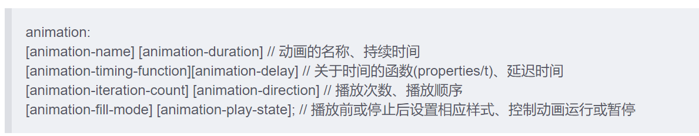

## 语法
```
#demo{
  animation: 时长 | 过渡方式 |延迟 | 次数 |方向 | 填充方式 | 是否暂停 | 动画名
}  


@keyframes keyframes-name {
  from{
    transform:translateX(0%);
  }
  to{
    transform:translateX(100%);
}
  
keyframes-name
帧列表的名称。 名称必须符合 CSS 语法中对标识符的定义。
from
等效于 0%.
to
等效于 100%.
————————————————
@keyframes name{
    0% { top: 0; }
    30% { top: 300px; }
    50% { top: 150px; }
    70% { top: 300px; }
    80% { top: 0px;  left:-200px;}
    100% { top: 0px;  }
  }

```
* 动画名称
* 时长 :1s或者1000ms
* 过渡方式-事件函数式:linear  | ease | ease-in | ease-out | ease-in-out | step-start | step-end |
* 延迟:自主设置与时长类似
* 次数:3或2.5或infinite(无限循环)
* 方向:
  1. normal 默认正序播放
  2. reverse 倒序播放
  3. alternate 交替播放
  4. alternate-reverse 反向交替播放
* 填充方式:
  1. none 动画执行前后不改变任何样式   
  2. forwards  保持目标动画的最后一帧的样式
  3. backwards  保持目标动画第一帧的样式
  4. both  动画将会执行backwards与forwards执行的动作
* 是否暂停:running (默认为正常播放) | paused (动画暂停)


## 简写属性
CSS animation 

>animation-name，animation-duration, animation-timing-function，animation-delay，animation-iteration-count，animation-direction，animation-fill-mode 和 animation-play-state 属性的一个简写属性形式。


JS中事件绑定
```
button.onclick=()=>{
  demo.classList.add('start')
  demo.style.animationPlayState='running'
  demo.style.animationIterationCount=2
}
xxx.onclick=()=>{
  demo.style.animationPlayState='paused'
  
}
```

[预览链接](http://js.jirengu.com/xuputanebe/2/edit)  
部分资料来自于MDN  饥人谷与https://blog.csdn.net/u013243347/article/details/79976352