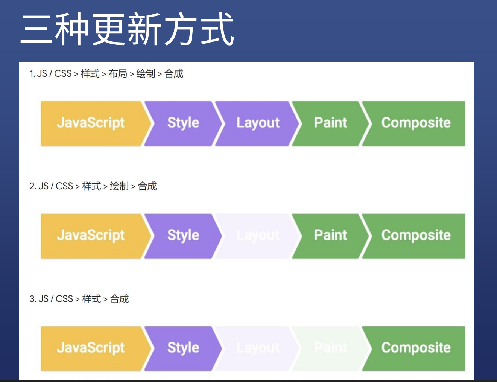

# CSS动画
## 1. CSS渲染方式
* 根据HTML构建html树(DOM)
* 根据CSS构建CSS树(CSSOM)
* 将2棵树合并成一颗渲染树(RENDER TREE)
* Layout 布局 (文档流,盒模型,大小位置)
* Piant 绘制 (边框颜色,文字颜色,阴影等画出来)
* Compose 合成 (根据层叠关系展示画面)
  
## 2. 如何更新样式
常用JS更新样式:
* 比如div.style.background='red'
* 比如div.classList.add/remove('red')
* 比如div.remove() 直接删除节点
### 3.有三种更新方式

1. 重排(relayout)——当RenderTree中的一部分(或全部)因为元素的规模尺寸，布局，隐藏等改变，浏览器为了重新渲染部分或整个页面，重新计算页面元素位置和几何结构的过程，也就是重新构造渲染树 ,这个过程叫做重排（relayout）,也可叫做reflow(回流)
* 页面初始渲染
* 添加/删除可见DOM元素
* 改变元素位置 ----- 定位属性及浮动
position,float
* 改变元素尺寸（宽、高、内外边距、边框等） ----- 盒子模型相关属性
height ,padding ,margin , display ,border-width ,min-height
* 改变元素内容（文本或图片等）
text-align , line-height ,vertical-align ,overflow , font-size,font-family,font-weight
* 改变窗口尺寸
* 获取元素的offsetWidth、offsetHeight、clientWidth、clientHeight、width、height、scrollTop、scrollHeight，请求了getComputedStyle(), 或者 IE的 currentStyle

2.重绘 (repaint) 页面元素只是外观发生改变但不影响布局,
* 更换背景颜色background-color
* 透明opacity.
* background，color，visibility， border-style ，border-radius outline-color，cursor，text-decoration， box-shadow
* 注意：由页面的渲染过程可知，reflow必将会引起repaint，而repaint不一定会引起reflow.   

资料来自网络[链接]{https://segmentfault.com/a/1190000005182937}

